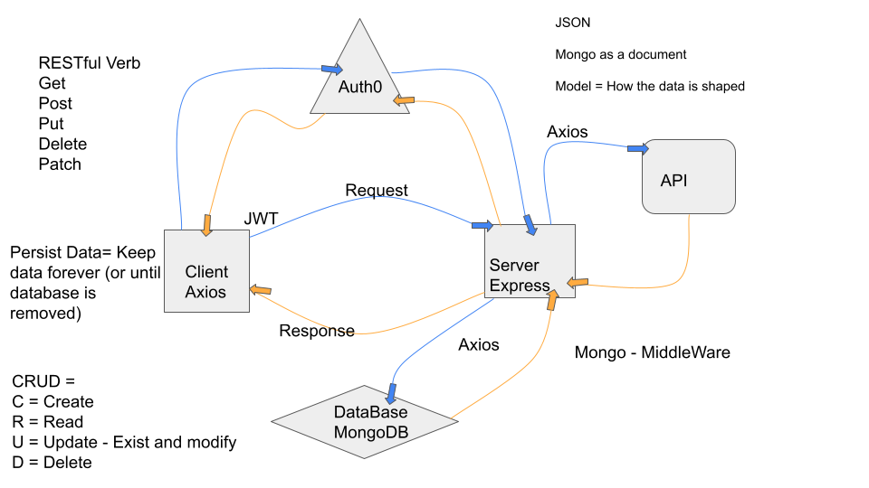

# Can of Books

**Author**: Charlie Fadness and Willem Jacobs
**Version**: 1.0.0 (increment the patch/fix version number if you make more commits past your first submission)

## Overview

Our overview in our Can of Books is having a user be able to store their favorite books. The user will be able to view, add, update, and delete their books as needed.

The user must be logged in through Auth0, and will only show the books that are linked to the users email.

## Getting Started
<!-- What are the steps that a user must take in order to build this app on their own machine and get it running? -->

## Architecture
<!-- Provide a detailed description of the application design. What technologies (languages, libraries, etc) you're using, and any other relevant design information. -->

UML for Lab 11

UML for Lab 13

## Change Log
<!-- Use this area to document the iterative changes made to your application as each feature is successfully implemented. Use time stamps. Here's an example:

01-01-2001 4:59pm - Application now has a fully-functional express server, with a GET route for the location resource. -->

## Credit and Collaborations
<!-- Give credit (and a link) to other people or resources that helped you build this application. -->
- [Auth0 Docs](https://auth0.com/docs)
- Willem Jacobs
- Ryan Galloway - Demo Code

## Name of feature: Starting with Auth0

Estimate of time needed to complete: 4 hours

Start time: 2:15pm 8/14/2021

Finish time: 4:45pm 8/14/2021

Actual time needed to complete: 2 hours and 30 minutes

## Name of feature: Mongo

Estimate of time needed to complete: 4 hours

Start time: 8/17/2021 8:30pm

Finish time: 8/18/2021 9:30pm

Actual time needed to complete: 4 hours

## Name of feature: Mongo, Auth0, Add, Delete

Estimate of time needed to complete: 6 hours

Start time: 2:30pm 8/21/2021

Finish time: 5:30pm 8/22/2021

Actual time needed to complete: 5.5 hours 

## Name of feature: Put

Estimate of time needed to complete: 6 hours

Start time: 8:30pm 8/24/2021

Finish time: 10:30pm 8/25/2021

Actual time needed to complete: 4 hours 
